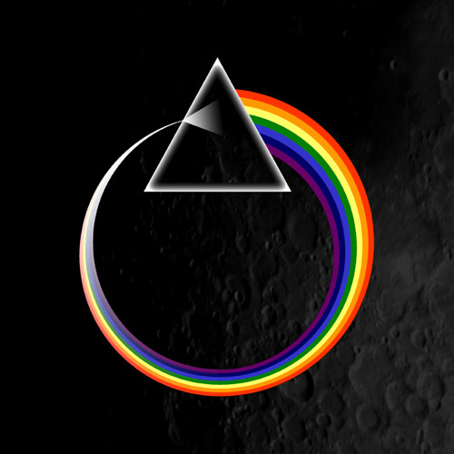

# hw01

Edit this README file to include a brief biography of yourself. Your README should include the following elements:
* Headers (one or more)
* Emphasis (italics or/and bold)
* Lists
* Images: add a picture (of yourself or something else) to your repo and embed it in your README
* Links
* A summary and reflection of the Git/GitHub workflow you adopted for this homework, and of your experience with Markdown (e.g., provide a summary of the workflow you adopted, and add some comments about something new you learned, something that surprised you, etc.)

Biography: My name is Anzhi Chen, a MACSS student. I graduated from NYU majoring in mathematics and sociology, but the majoriy of time was spent on mathematics. My concentration on math was differential equattion, and the thesis for sociology was about circulated economy and its application. Aftter graduation, I worked in a Consulting firm named NielsonIQ for one year as a researcher. I grow up in Beijing, China, and lived in Jersey City for the past five years.

# This is a header
## This is also a header
### This is also a header
*In this way it is an italics*
**This is bold**
1. list1
2. list2
   1. list2 has an item
   2. list2 has two items

[Google](http://www.google.com)

## 📚  Resources 
* [A short video explaining what GitHub is](https://www.youtube.com/watch?v=w3jLJU7DT5E&feature=youtu.be) 
* [Git and GitHub learning resources](https://docs.github.com/en/github/getting-started-with-github/git-and-github-learning-resources) 
* [Understanding the GitHub flow](https://guides.github.com/introduction/flow/)
* [How to use GitHub branches](https://www.youtube.com/watch?v=H5GJfcp3p4Q&feature=youtu.be)
* [Interactive Git training materials](https://githubtraining.github.io/training-manual/#/01_getting_ready_for_class)
* [GitHub's Learning Lab](https://lab.github.com/)
* [Education community forum](https://education.github.community/)
* [GitHub community forum](https://github.community/)
